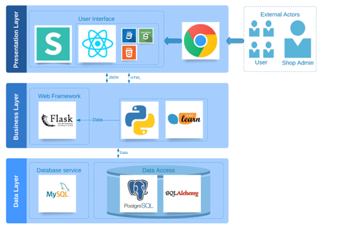

## The is a project for meeting the requriement of COMP3900 2021, a course at University of New South Wales (UNSW)
### Memeber:  Stella Yang, Ziqian Cao, Fa Liu, YiWei Li, and Zoe Li
### About: E-Commerce Shopping Website

### Project objectives - **Develop a commercial shopping website as specified by the user stories**. 

- A *user story* is a brief, informal description of a software feature from the user's perspective, detailing how it adds value.
- In agile development, user stories and acceptance criteria are the smallest work units, each reflecting project goals. 
- **We ensure these goals are met by providing functional solutions that satisfy user needs**.

#### User stories 
We had a brainstorm and discussed for a long time to produce our user stories to make them accurate and complete, which ensures that our user story not only satisfies all the basic requirements described in the project description, but also contains several distinct features which will provide special novel functionality to our website. 

1. **basic project objectives** need to be examined. Here are all the normal project objectives: 
   - Admin can add products with their details such as product name, description, features, warranty, and delivery date. 
   - Admin can also view and edit products information whenever required.	 
   - Admin can view all order details and can also view the sales of the products.  
   - Users need to register with basic registration details to generate a valid username and password. 
   - After login, users can view all the recommended products on the homepage.   
   - Users can select the desired product and view its details and add it to the shopping cart if he/she - wishes to buy it.   
   - Users can also ask queries to a chatbot regarding any product details and the chatbot will return the query result in form of text to speech. 	 
   - Users can do payment online. 
   - Users can view their order history of their purchased products. 
2. All project objectives were met by specific user stories, with **additional innovative features** included:
   - *Internet Connection Issue Handling*: 
     - If there's an internet issue, the website will utilize local storage to display content and inform users of the disconnection, improving user experience during downtimes. 
   - *Advanced Chatbot*: 
     - Beyond standard functionalities, our chatbot not only answers user queries but also offers alternative actions, such as contacting support or visiting external resources like Wikipedia for more information, thus effectively handling a wide range of user questions. 
   - *Flexible Recommendation System*: 
     - Our system surpasses typical recommendation engines by offering multiple methods of product suggestion. It can automatically suggest products, respond to specific requests (like choosing a birthday gift), and allow admins to target potential users directly, enhancing overall system efficiency.

### System Architecture
